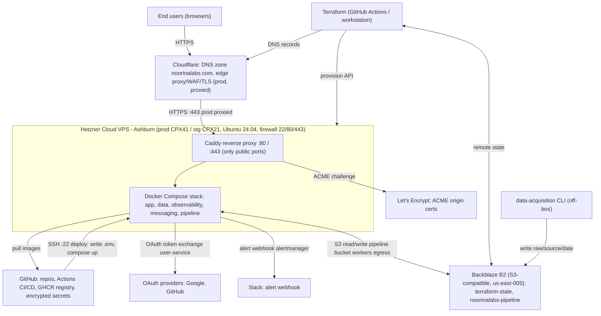
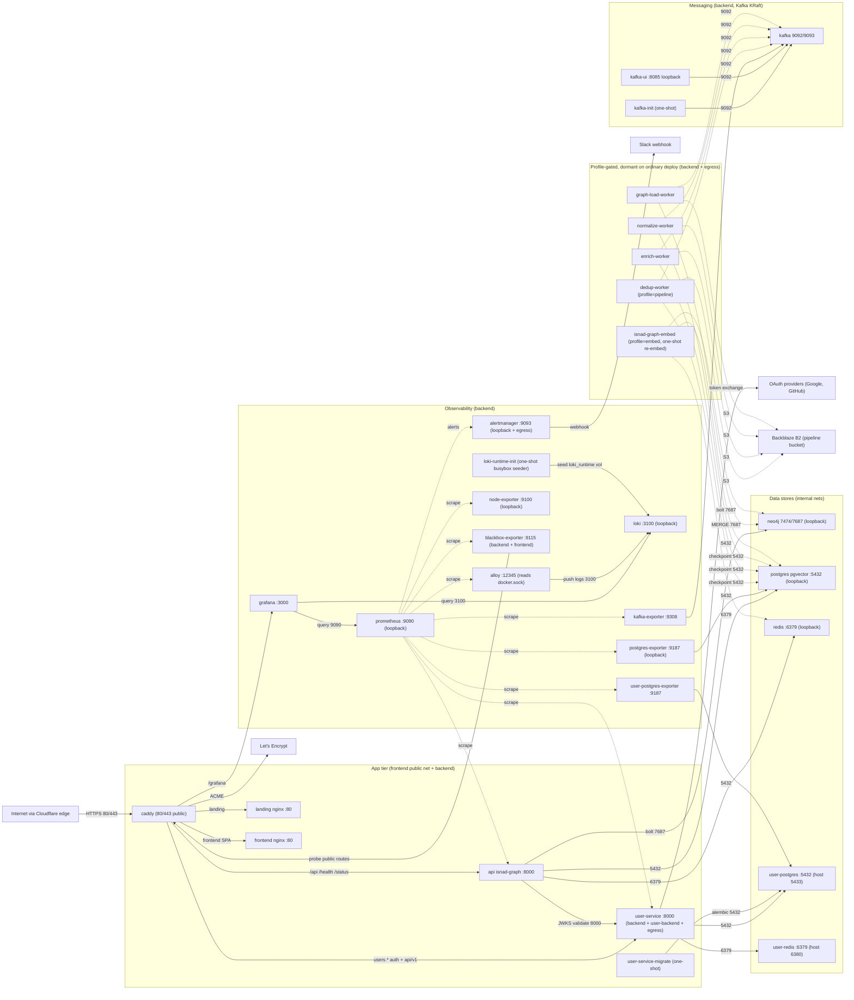

# Noorina Labs — System Architecture

Two levels of architecture diagram for the Noorina Labs platform, both derived
from ground truth in `noorinalabs-deploy/` (Terraform, Docker Compose, the
Caddyfile) and the org ontology (`ontology/services.yaml`,
`ontology/repos/deploy.yaml`). Markdown is the source of truth; the mermaid
blocks below are version-controlled and renderable, and can be picked up by the
docs-render pipeline (#767).

- **L1** — provider abstraction (#769): the external providers and the data
  that flows into and out of the Hetzner VPS boundary.
- **L2** — container systems (#770): every container on the VPS (all 30
  compose services) with its ingress and egress points (container-to-container
  plus external in/out).
- **L3** — per-container internals (#771): the internal data/logic flow of each
  container and what moves in/out of it, in a companion doc
  [`architecture-l3.md`](architecture-l3.md).

Each diagram is followed by a **Sources** note so the derivation is auditable.
Anything not directly evidenced in the deploy repo or ontology is flagged
**unverified** rather than asserted.

---

## L1 — Provider abstraction (#769)

The platform runs as a single Docker Compose stack on a Hetzner Cloud VPS (one
box per environment: prod `CPX41`, stg `CPX21`, both Ubuntu 24.04 in Ashburn).
Everything else is an external SaaS provider. The VPS firewall admits only SSH
(22), HTTP (80), and HTTPS (443); SSH is the deploy channel and 80/443 are the
only application-facing public ports (Caddy terminates them).

Data **into** the VPS: end-user browser traffic arrives over HTTPS, in prod
through the Cloudflare edge (proxied / orange-cloud — WAF, DDoS, edge cache),
in stg directly (gray-cloud, see L1 Sources); GitHub Actions reaches the box
over SSH to write `.env` and run `docker compose up`; the box pulls container
images from GHCR.

Data **out of** the VPS: image pulls from GHCR; ACME challenges to Let's
Encrypt for Caddy's origin certs; OAuth token-exchange calls from
`user-service` to Google/GitHub; alert webhooks from `alertmanager` to Slack;
and S3-style read/write from the (currently dormant) pipeline workers to the
Backblaze B2 `noorinalabs-pipeline` bucket.

A separate **control plane** runs off-box, from GitHub Actions or an operator
workstation: Terraform provisions the Hetzner VPS, manages the Cloudflare DNS
zone, and keeps its remote state in Backblaze B2; the `data-acquisition` CLI
(also off-box) writes raw source data into the same B2 pipeline bucket under
`raw/{source}/{date}/`.

**Sources (L1):**

- **Hetzner VPS / firewall / cloud-init** — `noorinalabs-deploy/terraform/hetzner/modules/hetzner-vps/main.tf`
  (`hcloud_firewall.web` rules SSH 22 / HTTP 80 / HTTPS 443; `hcloud_server.app`),
  `terraform/hetzner/envs/{stg,prod}/`; `ontology/repos/deploy.yaml` § `terraform_modules.hetzner` / `environments`.
- **Cloudflare DNS + edge** — `terraform/cloudflare/main.tf` (`cloudflare_zone_settings_override.ssl` = strict / min-TLS 1.2; prod records `proxied = true`, stg records `proxied = false`); `ontology/services.yaml` § `infrastructure.dns`.
- **Backblaze B2** — `terraform/backblaze/main.tf` (`b2_bucket.pipeline`, RW/RO `b2_application_key`), `terraform/cloudflare/main.tf` (remote-state reads of `hetzner/{prod,stg}.tfstate` from bucket `noorinalabs-terraform-state`); `ontology/services.yaml` § `infrastructure.state_backend`.
- **GitHub / GHCR / CI deploy over SSH** — `ontology/repos/deploy.yaml` § `workflows`, `local_patterns.env_injection` ("GitHub Actions writes .env on VPS via SSH"); `ontology/services.yaml` § `infrastructure.ci_cd` (deploy_method `appleboy/ssh-action`), `container_registry`.
- **Let's Encrypt** — `caddy/Caddyfile` (per-vhost automatic TLS); `ontology/services.yaml` § `caddy-reverse-proxy.tls`.
- **OAuth egress** — `compose/docker-compose.prod.yml` `user-service` (`AUTH_GOOGLE_*` / `AUTH_GITHUB_*`, `egress` network); `caddy/Caddyfile` `users.{$BASE_DOMAIN}` block.
- **Pipeline B2 egress** — `compose/docker-compose.prod.yml` `{dedup,enrich,normalize,graph-load}-worker` (`S3_ENDPOINT_URL`, `PIPELINE_B2_*`, `egress` network); `compose/.env.example` `PIPELINE_B2_*`.
- **data-acquisition off-box write** — `ontology/services.yaml` § `data-acquisition.output_target` (`B2 noorinalabs-pipeline/raw/{source}/{date}/`); `noorinalabs-data-acquisition` RUNBOOK (`raw/{source}/{YYYY-MM-DD}`).

**Unverified / flagged (L1):**

- **OAuth providers** — only Google and GitHub are wired in compose (`AUTH_GOOGLE_*`, `AUTH_GITHUB_*`). `ontology/services.yaml` § `integrations.oauth_flow` also lists `apple` and `facebook`; those are **not** evidenced in the running stack and are shown as Google/GitHub only.
- **Slack alert egress** — the `alertmanager` Slack webhook is wired via `api_url_file`, but the secret defaults to the placeholder `<unset>`; alerts route to Slack only once a real `SLACK_WEBHOOK_URL` is provisioned. PagerDuty/SMTP receivers (per deploy#127) are not yet present — **unverified**.
- **Backblaze B2 backups bucket** — `scripts/backup.sh` targets a `isnad-graph-backups` B2 bucket, but `ontology/repos/deploy.yaml` § `backup_service_state` records the backup service as **BROKEN (zero successful backups, ever)**. The VPS→B2 backup flow is therefore intended but **not operational**, and is omitted from the diagram.
- **stg proxy path** — prod is Cloudflare-proxied; stg records are gray-cloud (`proxied = false`, Cloudflare Universal SSL covers only one subdomain level), so stg browser traffic reaches origin Caddy directly. The diagram's edge labels reflect the prod (proxied) path.

---

## L2 — Container systems (#770)

The stack is the production Docker Compose file. All 30 of its services are
drawn below (verified against `compose/docker-compose.prod.yml` at
noorinalabs-deploy `origin/main` 273f220 — the diagram is exhaustive, not a
selection). Two of the 30 are profile-gated and dormant on an ordinary deploy
(`isnad-graph-embed`, profile `embed`; the four pipeline workers, profile
`pipeline`); two more are one-shot init containers (`user-service-migrate`,
`loki-runtime-init`). Containers are partitioned
across four Docker networks: `frontend` (public-facing, non-internal),
`backend` (internal — app, data, observability, messaging), `user-backend`
(internal — user-service and its dedicated DBs), and `egress` (outbound-only to
the public internet, for services that need to reach external hosts but accept
no inbound). Several containers are multi-homed; in the diagram below each is
placed in its functional tier and its networks are noted in the label.

**Public ingress** is `caddy` only: it binds `0.0.0.0:80` / `:443` and
path-routes three vhosts — `{$BASE_DOMAIN}` → `landing`, `isnad.{$BASE_DOMAIN}`
→ `frontend` + `api` (+ `/grafana` → `grafana`), and `users.{$BASE_DOMAIN}` →
`user-service`. Every other host-published port is bound to `127.0.0.1` only
(operator access via SSH tunnel): neo4j 7474/7687, postgres 5432, redis 6379,
user-postgres 5433, user-redis 6380, prometheus 9090, alertmanager 9093, loki
3100, node-exporter 9100, postgres-exporter 9187, kafka-ui 8085. The remaining
containers use `expose` only (reachable solely on the Docker networks): `api`,
`frontend`, `landing`, `user-service`, `grafana`, `blackbox-exporter` (9115),
`kafka` (9092/9093), `kafka-exporter` (9308), `user-postgres-exporter` (9187).

**Application egress:** `api` reaches `neo4j` (bolt 7687), `postgres` (5432),
`redis` (6379), and `user-service` (8000, JWKS/JWT validation). `user-service`
reaches `user-postgres` (5432) and `user-redis` (6379), and uses the `egress`
network for OAuth provider calls. The one-shot `user-service-migrate` runs
`alembic upgrade head` against `user-postgres` before `user-service` starts.
`isnad-graph-embed` (profile `embed`, `restart: "no"`, `backend` + `egress`) is
an operator/workflow-triggered re-embedding runner (ADR 0008, 384-dim
sentence-transformer) that reads the same `neo4j` (bolt 7687) / `postgres`
(5432) / `redis` (6379) backends as `api`; it is dormant on an ordinary deploy.

**Observability:** `prometheus` scrapes exactly eight jobs (verified against
`prometheus.prod.yml` @ 273f220): the app `/metrics` (`api`, `user-service`),
every exporter (`node-exporter`, `postgres-exporter`, `user-postgres-exporter`,
`kafka-exporter` as job `kafka`, `blackbox-exporter` via its `/probe` job), and
`alloy`'s self-metrics over `backend`; it pushes alerts to `alertmanager` (the
alert receiver, not a scrape job). `loki` and `grafana` are **not** scraped in
prod. `grafana` queries `prometheus` (9090) and `loki` (3100).
`alloy` (the promtail successor) reads the Docker socket + container log files
and pushes to `loki` (3100). The one-shot `loki-runtime-init` (busybox) seeds
the `loki_runtime` overrides volume before `loki` starts (`loki` declares
`depends_on: loki-runtime-init`), so the hot-reloadable per-tenant retention
overrides always exist on first load. `blackbox-exporter` is dual-homed
(`backend` + `frontend`) so it can probe the public Caddy routes. `alertmanager`
is dual-homed (`backend` + `egress`) to reach Slack.

**Messaging + pipeline:** single-node `kafka` (KRaft, no ZooKeeper) is reached
only over `backend` by `kafka-init` (one-shot topic creation), `kafka-ui`
(loopback admin), and `kafka-exporter`. The four pipeline workers
(`dedup` → `enrich` → `normalize` → `graph-load`) are **profile-gated**
(`profiles: ["pipeline"]`) and do **not** start under a plain `docker compose
up`; when enabled they consume/produce Kafka topics, checkpoint to `postgres`,
and (graph-load) MERGE into `neo4j`, reaching Backblaze B2 over `egress`.

**Sources (L2):**

- **All 30 containers, ports, networks, env, depends_on** — `noorinalabs-deploy/compose/docker-compose.prod.yml` at `origin/main` 273f220 (the complete service set; `networks:` block defines `backend`/`user-backend` `internal: true`, `frontend`, `egress`; host-port bindings `127.0.0.1:*` vs `expose`).
- **`isnad-graph-embed`** — `compose/docker-compose.prod.yml` L230 (`profiles: ["embed"]`, image `ghcr.io/noorinalabs/noorinalabs-isnad-graph-embed`, `restart: "no"`, `backend` + `egress`, `depends_on` neo4j+postgres, `PG_DSN`/`REDIS_URL`/`NEO4J_*` env); ADR 0008 (deploy#461), 384-dim re-embed runner for pgvector semantic search.
- **`loki-runtime-init`** — `compose/docker-compose.prod.yml` L833 (busybox one-shot seeding `loki_runtime` overrides volume); `loki` (L855) `depends_on: loki-runtime-init` `service_completed_successfully` (deploy#451).
- **Caddy vhost routing** — `caddy/Caddyfile` (`{$BASE_DOMAIN}`, `isnad.{$BASE_DOMAIN}`, `users.{$BASE_DOMAIN}` handle blocks; `:2021 /healthz`; `/metrics → respond 403`).
- **api → user-service JWT/JWKS** — `compose/docker-compose.prod.yml` `api.AUTH_USER_SERVICE_URL=http://user-service:8000`; `ontology/services.yaml` § `integrations.jwt_validation`.
- **Pipeline stage/topic flow** — `compose/docker-compose.prod.yml` worker block comment (`pipeline.raw.landed → dedup → … → ingest → Neo4j`, `pipeline.dlq`); `ontology/services.yaml` § `isnad-ingest-platform.workers`.
- **Per-image / observability versions** — `ontology/repos/deploy.yaml` § `docker_services` (cross-checked against the compose `image:` pins).
- **Prometheus scrape set** — verified against `infra/prometheus/prometheus.prod.yml` at `noorinalabs-deploy` `origin/main` 273f220 (`scrape_configs`): eight jobs — `api` (`api:8000` `/metrics`), `node-exporter` (`node-exporter:9100`), `postgres-exporter` (`postgres-exporter:9187`), `user-service` (`user-service:8000` `/metrics`), `user-postgres-exporter` (`user-postgres-exporter:9187`), `kafka` (target `kafka-exporter:9308`), `alloy` (`alloy:12345`), and `blackbox` (`/probe`, 6 prod routes via `blackbox-exporter:9115`). `alertmanager:9093` is the `alerting:` receiver, not a `scrape_configs` job. `loki` and `grafana` have no scrape job.

**Unverified / flagged (L2):**

- **Two services are profile-gated / dormant on an ordinary deploy** — the four `*-worker` services carry `profiles: ["pipeline"]` (image `ghcr.io/noorinalabs/noorinalabs-isnad-ingest-platform` not yet published; per the compose comment the streaming pipeline "has never run on staging", main#601), and `isnad-graph-embed` carries `profiles: ["embed"]` (operator/workflow-triggered re-embed via `reembed-corpus.yml`). All five are drawn dotted to indicate they do not start under a plain `docker compose up`.
- **alloy vs promtail** — the live stack runs `grafana/alloy` (deploy#132 successor); `ontology/services.yaml` § `infrastructure.observability` still names Promtail. Ground truth (compose) wins — diagram shows `alloy`.
- **Prometheus scrape edges — now verified (corrected here).** An earlier draft summarized the scrape edges from each exporter's purpose without opening the Prometheus config, and drew `prometheus` scraping `loki` and `grafana`. Reading `infra/prometheus/prometheus.prod.yml` @ 273f220 (see Sources) shows that is wrong: `loki`/`grafana` have no scrape job, and `alloy` (which the draft omitted) does. The diagram above is corrected to the eight real `scrape_configs` jobs; the per-env `prometheus.stg.yml` variant is not drawn (the diagram reflects prod).
- **services.yaml drift** — `ontology/services.yaml` predates several deploy changes (it lacks `blackbox-exporter`, `kafka-exporter`, `kafka-init`, `user-service-migrate`, `isnad-graph-embed`, `loki-runtime-init`, the `egress` network, and the pipeline workers; it lists `promtail`). The diagrams above follow the compose file at `origin/main` 273f220, which is newer.
