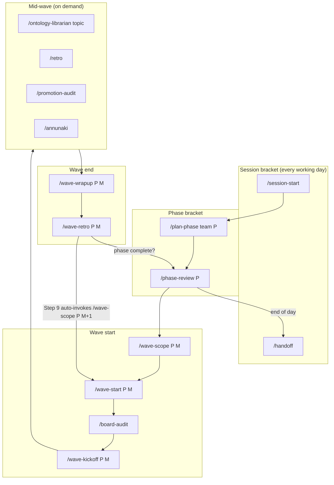

# Noorina Labs — Phase → Wave Lifecycle as a Slash-Command Flow

This document describes the **entire** org operating cycle — starting a phase,
setting up a wave, executing it, and closing waves — as the ordered sequence of
slash commands that drive it, and for **each** command the concrete actions it
takes across four axes:

- **(a) code/repo actions** — files read/written, git operations, worktrees, `.claude/lib` helpers, sub-skill invocations
- **(b) GitHub API** — issues, PRs, project board (project 2), labels, branches/refs, Actions/workflows
- **(c) MCP calls** — Model-Context-Protocol servers/tools, if any
- **(d) other external-service API calls** — anything beyond GitHub

> **Source of truth.** Every entry below was derived by reading the actual
> `SKILL.md` under `.claude/skills/` at authoring time, not from memory. This
> markdown is the canonical source from which the Word-format companion
> (noorinalabs-main#767) is generated — keep it cleanly structured (one heading
> per command, the four axes in a stable order).

> **Companion docs.** [`.claude/team/lifecycle.md`](../.claude/team/lifecycle.md)
> is the canonical authority on **skill ordering, preconditions, and the
> `cross-repo-status.json` keys each skill reads/writes** (counter ownership,
> gate checks). This doc is the complementary **per-command external-surface**
> view (the four axes). Where the two disagree on ordering, `lifecycle.md` (and
> ultimately each `SKILL.md`) wins.

---

## At-a-glance ordered flow

The cycle nests three brackets: a **session** brackets every working day; a
**phase** brackets a body of strategic work; a **wave** brackets one execution
sprint within a phase. A phase contains many waves; a wave spans many sessions.

Numbered canonical order (the happy path):

1. `/session-start` — mandatory first action of every session.
2. `/plan-phase {team} {P}` — decompose a new phase into issues + a proposed wave structure (phase boundary only).
3. `/phase-review {P}` — track-check; mandatory immediately before each `/wave-scope`.
4. `/wave-scope {P} {M}` — reconcile declared vs. labeled wave scope; refresh the meta-issue.
5. `/wave-start {P} {M}` — park on clean `main`, prune worktrees, ensure the wave label, stamp active-wave state.
6. `/board-audit` — sync project-2 orphans and the Wave field from labels.
7. `/wave-kickoff {P} {M}` — create wave branches in every scoped repo, label issues, post kickoff comments, spawn implementers.
8. *(execution)* — implementation PRs; on demand: `/ontology-librarian`, `/retro`, `/promotion-audit`, `/annunaki`.
9. `/wave-wrapup {P} {M}` — review + merge PRs, close issues, clean worktrees, rebuild ontology.
10. `/wave-retro {P} {M}` — assessments, trust-matrix + feedback-log updates, then auto-invokes `/wave-scope {P} {M+1}` (loop to step 4).
11. `/handoff` — write the session pickup file (end of session; loop to step 1 next session).

A phase ends — with no dedicated close-out skill — when every tracking issue in
`phase-{P}.md` is closed and the tech-debt exit gate is met; the next
`/plan-phase` opens the following phase.

---

## Session bracket

### `/session-start`

**Purpose:** mandatory first action of every session — establishes situational
awareness across 7 steps (worktree hygiene, team model, handoff, ontology,
Annunaki, wave/phase orientation, charter freshness).

- **(a) code/repo actions:** anchors `REPO_ROOT` to the parent org repo via `git rev-parse --git-common-dir`; runs `.claude/lib/sync_main.py` (fast-forward-only sync of a clean, strictly-behind `main`); iterates the parent + 7 child repos calling `git worktree prune` / `worktree list` / `worktree remove` with a verify-merged-then-remove guard (`git merge-base --is-ancestor … origin/main`); reads `.claude/memory/session_handoff.md`, `cross-repo-status.json`, and the tail of `.claude/team/feedback_log.md`. Sub-skills: `/ontology-rebuild` (step 3), `/annunaki` (step 4), and `/board-audit` (step 5, only if board↔label drift is observed).
- **(b) GitHub API:** `git fetch origin main` per repo; `gh issue list` (open-issue + blocker count); `gh api repos/noorinalabs/{repo}` for default branch; `gh api …/actions/runs?branch={default}` to find the latest publish/deploy/release run per workflow on each repo's default branch (Step 5a red-run detection) plus `gh run view --log-failed` for base-image-CVE cause classification.
- **(c) MCP calls:** none.
- **(d) other external services:** none.

### `/handoff`

**Purpose:** write a session pickup prompt so the next session resumes
seamlessly (richer than the automatic `Stop`-hook handoff).

- **(a) code/repo actions:** `git status` / `git log --oneline -10` / `git branch --show-current`; reads `cross-repo-status.json` and `ontology/checksums.json` (dirty-file count); writes `.claude/memory/session_handoff.md` and updates the `MEMORY.md` index (single handoff entry, replace-in-place). Also echoes the full handoff to the console.
- **(b) GitHub API:** `gh pr list` across all repos; `gh issue list` for recent open issues.
- **(c) MCP calls:** none.
- **(d) other external services:** none.

> An always-on `Stop` hook (`session_handoff.py`) auto-writes the same file
> after every response (throttled to 5 min); `/handoff` adds conversational
> context the hook cannot infer. The gitignored handoff is local-only.

---

## Phase bracket

### `/plan-phase {team} {P}`

**Purpose:** decompose a new phase's scope into GitHub issues, review them from
six perspectives, and propose a wave structure for owner approval. **Phase
boundary only** — does not start work.

- **(a) code/repo actions:** `git rev-parse --show-toplevel`; reads `cross-repo-status.json` and previous-phase retro/memory for carry-overs; writes `/tmp/all_open.txt`, `/tmp/board_urls.txt`, `/tmp/board.json`. The hand-authored `phase-{P}.md` plan doc is informed by Step 7's owner-approved structure but not written by this skill.
- **(b) GitHub API:** `gh issue list --state open` across all 8 repos for the pre-phase drift audit; `gh project item-list 2` (board is the authoritative backlog); `gh issue create` per work item with phase/category labels; `gh issue edit --add-label` for assignee labels; `gh issue comment` for the six per-issue review-perspective comments.
- **(c) MCP calls:** none.
- **(d) other external services:** none.

### `/phase-review {P}`

**Purpose:** read-only phase track-check — what's done / in flight / blocked,
plus the tech-debt ratio against the exit gate. **Mandatory before every
`/wave-scope`** (`/wave-scope` Step 0.5 Gate A blocks otherwise).

- **(a) code/repo actions:** reads `.claude/team/phases/phase-{P}.md` (STOPs to `/plan-phase` if missing); greps tracking-issue refs from it; may edit `phase-{P}.md` with owner confirmation and commit it.
- **(b) GitHub API:** `gh issue view` per tracking issue (state/labels/closedAt); `gh issue list --search "created:>=…"` and `--label tech-debt` to compute the new-filed and cumulative-open tech-debt ratios, repeated across all 7 child repos.
- **(c) MCP calls:** none.
- **(d) other external services:** none.

---

## Wave start

### `/wave-scope {P} {M}`

**Purpose:** allocate the global wave id (Step 0.0), reconcile declared scope
(meta-issue) against the actually-labeled scope across repos, fold in retro
carry-forwards and memory must-includes, apply label churn per owner
dispositions, top up with the +20% tech-debt intake, and refresh the meta-issue
body. **Writes** `global_wave_seq`, `wave_{M}_phase`, `wave_{M}_phase_ordinal`,
`wave_{M}_scope_reconciled_at`, `wave_{M}_repos_in_scope`, `wave_{M}_meta_issue`,
`wave_{M}_scope`. (`{M}` is a **global monotonic wave id** — main#804; phase is a
derived display field, never part of the key.)

- **(a) code/repo actions:** Step 0.0 allocates the next global wave id + stamps the phase/ordinal display fields via `.claude/lib/wave_seq.py` (`peek` then `allocate --phase {P} --write`); reads `cross-repo-status.json` (carry-forwards), `.claude/team/feedback_log.md`, `.claude/memory/*.md` (W{M} must-includes), `.claude/team/phases/phase-{P}.md`; writes `/tmp/wavescope-{M}-*` working files; runs `.claude/lib/upsert_status_keys.py` (Step 13 key upserts) and `.claude/skills/wave-scope/validate_matrix_names.py` (roster-name validation). Precondition: `/phase-review {P}` ran this session (Gate A); owner theme written (Gate B).
- **(b) GitHub API:** `gh issue view/list --label` across all 8 repos to compare declared vs. labeled scope; `gh issue create` (stub meta-issue if absent); `gh label list` / `gh label create` (next-wave label); `gh issue edit --add-label/--remove-label` and `gh issue close --comment` (label churn / obsolete close); `gh api PATCH …/issues/{meta}` to rewrite the meta-issue body (with read-back verify); `gh project item-add 2` for selected tech-debt issues.
- **(c) MCP calls:** none.
- **(d) other external services:** none.

### `/wave-start {P} {M}`

**Purpose:** local hygiene + setup — park the orchestrator checkout on fresh
`main`, prune stale worktrees, ensure the `p{P}-wave-{M}` label, and stamp
active-wave state onto `main`. Does **not** create the wave branch (that is
`/wave-kickoff` Step 1). The former § 5a per-phase wave-key reset is **retired**
(main#804): global monotonic wave ids never reuse a number, so there are no
stale cross-phase `wave_{M}_*` keys to clear — allocation happens once at
`/wave-scope` Step 0.0.

- **(a) code/repo actions:** `git worktree prune` / `worktree list`; `git fetch origin main`, guarded `git stash push` of only regenerable churn (`errors.jsonl`, `cross-repo-status.json`, `checksums.json`), `git checkout main`, `git pull --ff-only` — STOPs (never auto-discards) on non-regenerable dirty state or unmerged local commits; `git ls-remote --heads origin` to check the prior wave branch. (No per-phase wave-key reset — `wave_key_reset.py` was deleted in main#804.) Sub-skill: `/retro` (Step 7, when not Wave 1).
- **(b) GitHub API:** `gh label list` / `gh label create` for the wave + standard category labels; the **PUT-contents recipe** — `gh api …/contents/cross-repo-status.json?ref=main` (read) then `gh api -X PUT …/contents/cross-repo-status.json` (atomic write of active-wave fields on `main`, with read-back verify) — instead of a local commit+push.
- **(c) MCP calls:** none.
- **(d) other external services:** none.

### `/board-audit`

**Purpose:** detect and repair project-2 drift — orphan issues missing from the
board, and Wave-field values out of sync with `p{N}-wave-{M}` labels (labels are
canonical; the Wave field is a derived projection). Read-only audit then a
confirmation-gated repair; no `cross-repo-status.json` writes.

- **(a) code/repo actions:** writes `/tmp/board-items.json`, `/tmp/board-wave-values.tsv`, `/tmp/wave-options.json`. Prerequisite: `/ontology-librarian` ran first (Hook 15). No git mutations.
- **(b) GitHub API:** `gh issue list --state open --limit 500` across all 8 repos (orphan detection); `gh api graphql` to read all project-2 items + field values and to resolve the Wave field/option IDs; `gh issue view --json labels` per board item (drift detection); `gh project item-add 2` (bulk-add orphans, GraphQL `addProjectV2ItemById` fallback on silent no-op); `gh api graphql` `updateProjectV2ItemFieldValue` / `clearProjectV2ItemFieldValue` mutations to sync the Wave field.
- **(c) MCP calls:** none.
- **(d) other external services:** none.

### `/wave-kickoff {P} {M}`

**Purpose:** create the `deployments/phase-{P}/wave-{M}` branch in every scoped
repo, apply wave labels (hook auto-posts kickoff comments), build ontology
context, and spawn implementers. **Writes** `wave_{M}_branches`, `current_wave`,
`last_completed_wave`, `next_wave`, `wave_{M}_active`, `wave_{M}_kicked_off_at`.

- **(a) code/repo actions:** reads `cross-repo-status.json` (`wave_{M}_scope_reconciled_at`, `wave_{M}_repos_in_scope`); per-wave orchestration scripts under `.claude/skills/wave-kickoff/_orchestration/`; `.claude/lib` upsert helpers for the status write. Sub-skill: `/ontology-librarian {repo} {area}` per implementer (output baked into spawn prompts; agents are also told to invoke it themselves for Hook 15). Preconditions: `/board-audit` ran, scope reconciled and post-dating the prior retro, 6-check pre-flight.
- **(b) GitHub API:** `gh api …/git/refs/heads/main` (base SHA) + `gh api -X POST …/git/refs` to create the wave branch per repo (422-safe idempotent), `gh api …/compare/main...{sha}` to classify existing branches; `gh label list`/`create`; `gh api -i user` (OAuth scope check); `gh run list --branch main` per repo (CI health) + `gh issue create` for CI-red findings; `gh pr list --state merged` (cross-reference resolved issues); `gh issue edit --add-label "p{P}-wave-{M}"` (fires the kickoff-comment PostToolUse hook); `gh project item-add 2`; the PUT-contents status commit (`gh api -X PUT …/contents/cross-repo-status.json`).
- **(c) MCP calls:** none.
- **(d) other external services:** none. *(Implementer agents are spawned via the harness `Agent` tool, not an MCP/external API.)*

---

## Mid-wave (on demand)

### `/ontology-librarian {topic}`

**Purpose:** read-only ontology reference — staleness check + context lookup.
**Mandatory (Hook 15) before any Edit/Write** in a session, including inside
spawned implementer agents.

- **(a) code/repo actions:** writes the Hook-15 consultation sentinel `.claude/.consulted/ontology-librarian/{cwd-hash}.marker`; reads `ontology/checksums.json` (dirty count), `ontology/domain.yaml`, `ontology/services.yaml`, `ontology/conventions.md`, `ontology/repos/*.yaml`. Never modifies the ontology.
- **(b) GitHub API:** none.
- **(c) MCP calls:** none.
- **(d) other external services:** none.

### `/retro`

**Purpose:** lightweight mid-wave health pulse — progress, blockers, CI health,
friction — with no trust-matrix or feedback-log writes. Inline output only.

- **(a) code/repo actions:** reads `cross-repo-status.json`. No file writes, no git mutations.
- **(b) GitHub API:** `gh pr list` (merged + open), `gh issue list` (closed + open for the wave label), `gh run list --limit 20` (CI pass/fail ratio).
- **(c) MCP calls:** none.
- **(d) other external services:** none.

### `/promotion-audit [{wave}]`

**Purpose:** deterministic audit of the memory → charter → skill → hook
promotion pipeline — auto-promotes AUTO-tier artifacts, files DECIDE-tier issues
with drafts, writes a per-wave audit log. Driven by a byte-deterministic
`run.py`. Auto-invoked from `/wave-retro` Step 7.5.

- **(a) code/repo actions:** reads all `.claude/memory/*`, all `.claude/team/charter/*` sections, all `.claude/skills/*`, `cross-repo-status.json` (pinned timestamps), and git log (skill-invocation + retro-citation counts); writes AUTO-tier charter sections and `.claude/skills/{slug}/SKILL.md` scaffolds, memory `superseded_by` back-refs, `.claude/scratch/promotion-audit-{wave}-*` drafts, `.claude/team/promotion_audit_log/{wave}.md`, and (inside a retro) appends `.claude/team/feedback_log.md`; commits with the Aino identity on an `A.Virtanen/promotion-audit-{wave}-{ts}` branch and pushes. Helpers: `.claude/skills/promotion-audit/run.py` + `helpers.py`.
- **(b) GitHub API:** for AUTO-tier promotions, `gh pr create` (labeled `tech-debt`/`enhancement`/`p{N}-wave-{M}`, based on the wave branch) + `gh pr view/edit` label verify + `gh project item-add 2` (read-back-verified); for DECIDE-tier (always skill→hook), `gh issue create` + `gh issue view` + the same board add. Reviewer spawn is via `SendMessage`, **not** `gh pr review`.
- **(c) MCP calls:** none.
- **(d) other external services:** none.

### `/annunaki`

**Purpose:** status viewer for the always-on error monitor — counts genuine
errors (excluding benign traces) and surfaces recent ones; suggests
`/annunaki-attack` at 5+ unprocessed errors. Does not fix anything.

- **(a) code/repo actions:** hook-active check — confirms `post_dispatcher.py` is wired on `PostToolUse` Bash in `.claude/settings.json` **and** `annunaki_monitor` is registered in its `_REGISTRY` (post-#625 the monitor is dispatched, not wired directly — see #788); reads `.claude/annunaki/errors.jsonl` via `.claude/lib/annunaki_parse.py` (skips blanks/corrupt lines and benign `traces.jsonl`-class records). No writes.
- **(b) GitHub API:** none.
- **(c) MCP calls:** none.
- **(d) other external services:** none.

> **Adjacent (invoked by the wrapup/retro engines, not part of the linear happy
> path):** `/annunaki-attack` (analyze captured errors, file issues, implement
> fixes — GitHub `gh issue`/PR side effects), and `/watch-deploy {stg|prod}`
> (polls a GitHub Actions deploy run in `noorinalabs-deploy` to terminal via
> `gh run`, classifies failures, bounded fix-forward on staging only — a
> GitHub-API health check, **no browser/MCP usage**).
>
> **MCP is absent throughout the lifecycle.** No lifecycle command —
> `/watch-deploy` included — calls an MCP server; the entire flow is `git` +
> `gh`/`gh api` + `.claude/lib` helpers. The only place the **Chrome MCP**
> (`claude-in-chrome`) is used anywhere in the org workflow is the **on-demand
> live-app E2E pass** (lifecycle.md § Mid-wave "Exploratory / E2E live-app
> pass") — driving the deployed UI through the operator's already-authenticated
> session and filing findings per the bug→issue→PR workflow. That pass is not a
> slash command and not part of the lifecycle happy path.

### Exploratory / E2E live-app pass

**Purpose:** the one on-demand, non-command step in the org workflow that uses
the **Chrome MCP** (`claude-in-chrome`). An operator-initiated pass that drives
the **deployed** app's UI (staging or prod) through the operator's
already-authenticated browser session — clicking through real flows, reading the
rendered DOM/console/network, and spotting behaviour a unit/integration test
would not (visual regressions, broken auth redirects, empty-state rendering,
500s behind a button). Findings are filed through the normal bug→issue→PR
workflow. It is **not** a slash command and **not** part of the linear happy
path — it is invoked only when a human wants eyes on the live product.

- **(a) code/repo actions:** none directly; any fix lands as a normal issue→PR.
- **(b) GitHub API:** only via the downstream bug→issue→PR workflow (`gh issue`/PR).
- **(c) MCP calls:** the Chrome MCP (`claude-in-chrome`) — the sole MCP usage anywhere in the org workflow.
- **(d) other external services:** the deployed app under test (staging/prod URL).

---

## Wave end

### `/wave-wrapup {P} {M}`

**Purpose:** finalize a wave — review + merge PRs in dependency order, close
resolved issues, clean wave worktrees, verify staging promotion and wave-branch
reachability, and rebuild the ontology. **Authoritative writer** of the three
counter keys `wave_{M}_final_pr_count`, `wave_{M}_changes_requested_cycles`,
`wave_{M}_top_concentration_pct` (Step 10.5).

- **(a) code/repo actions:** reads `cross-repo-status.json` (`wave_{M}_repos_in_scope`, `wave_{M}_kicked_off_at`); `git worktree prune/list/remove`; `git push origin --delete {feature-branch}` (feature branches only — wave branches are retained); `git merge-base` / `git diff --name-only … -- '.claude/**'` (artifact-change detection); `git reset --hard origin/{branch}` (high-volume re-sync). Helpers: `.claude/lib/wave_status.py counters … --write` (counter computation with cross-window filter + loud-fail on count mismatch), `.claude/lib/upsert_status_keys.py`, `.claude/lib/generic_prompt_tracker.py`. Sub-skills: `/ontology-rebuild` (Step 12), `/wave-audit` logic (Step 6 issue close), and fallback `/annunaki-attack` (Step 13) + memory-to-automation audit (Step 14), both run-marker-guarded; `/watch-deploy stg {sha}` per fan-in merge (Step 11.6a).
- **(b) GitHub API:** `gh pr list --base deployments/phase-{P}/wave-{M}` and `--base main --label p{P}-wave-{M}` (inventory); `gh pr checks` / `gh pr diff` / `gh pr view --json` (review + Closes/Fixes parse); `gh pr merge --merge --delete-branch` for feature PRs (Step 5), but `gh pr merge --merge` **without** `--delete-branch` for the wave→main merge (Step 11 — wave branches are retained permanently); `gh issue list`/`close`; `gh run list --workflow deploy-stg.yml` (staging-deploy status); `gh api …/git/refs/heads/{branch|main}` + `…/compare/main...{branch}` (final-wave reachability gate, Step 11.5) and `gh pr create --base main --head {wave-branch}` (wave→main PR); `gh api …/actions/workflows/ghcr-publish.yml/runs` + `gh run view --log-failed` (publish-freshness / base-image-CVE classification); retro-PR body-vs-diff check via `gh pr list --search 'retro('` + `gh pr view --json files,body`.
- **(c) MCP calls:** none. The `/watch-deploy stg` it triggers is a GitHub-Actions health check (`gh run`), not a browser/MCP pass.
- **(d) other external services:** GitHub Actions (workflow runs/conclusions/logs via `gh run`); staging/production deploys are triggered indirectly through `noorinalabs-deploy` workflows (staging auto, production only after owner approval).

### `/wave-retro {P} {M}`

**Purpose:** comprehensive end-of-wave retrospective — PR analysis, per-engineer
assessments, trust-matrix + feedback-log updates, charter-change proposals; then
auto-invokes `/wave-scope {P} {M+1}` to seed the next wave. **Verifies** (never
writes) the three counter keys; drift > ±2 or > ±5% blocks the retro.

- **(a) code/repo actions:** reads `cross-repo-status.json` and project-2 state; writes `.claude/team/trust_matrix.md` (directly on the retro branch), appends `.claude/team/feedback_log.md`, and (via the sub-skill) `.claude/team/promotion_audit_log/{wave}.md`; writes `wave_{M}_counter_corrections`, run-markers, and `wave_{NEXT}_meta_issue` via `.claude/lib/upsert_status_keys.py`. Sub-skills: `/ontology-librarian` (Step 1 staleness), `/board-audit` (Step 1.5), `/promotion-audit` (Step 7.5), `/annunaki-attack` (Step 7.6, run-marker-guarded), memory-to-automation audit (Step 7.7), `/wave-scope {P} {M+1}` (Step 9, conditional on a set next-wave theme).
- **(b) GitHub API:** `gh pr list --state merged --base deployments/phase-{P}/wave-{M}` + `gh pr view --json reviews,comments` (assessment data); `gh run list --branch {pr-branch}` (CI history); `gh pr view {retro-PR} --json files` (Step 6.5 diff sanity); `gh issue list --search` / `gh issue create` (next-wave meta-issue stub) + `gh project item-add 2`.
- **(c) MCP calls:** none.
- **(d) other external services:** none.

---

## Command × axis summary

| Command | (a) code/repo | (b) GitHub API | (c) MCP | (d) other ext. |
|---------|:---:|:---:|:---:|:---:|
| `/session-start` | ✓ worktrees, sync, memory | ✓ issues, runs | — | — |
| `/handoff` | ✓ memory, git state | ✓ PRs, issues | — | — |
| `/plan-phase` | ✓ tmp board files | ✓ issues, board, comments | — | — |
| `/phase-review` | ✓ phase doc | ✓ issues, TD ratio | — | — |
| `/wave-scope` | ✓ status, memory, tmp | ✓ issues, labels, board, meta-issue | — | — |
| `/wave-start` | ✓ worktrees, git park | ✓ labels, PUT-contents | — | — |
| `/board-audit` | ✓ tmp board files | ✓ issues, project GraphQL | — | — |
| `/wave-kickoff` | ✓ status, orchestration | ✓ refs, labels, board, PUT-contents | — | — |
| `/ontology-librarian` | ✓ sentinel, ontology read | — | — | — |
| `/retro` | ✓ status read | ✓ PRs, issues, runs | — | — |
| `/promotion-audit` | ✓ charter/skills/memory write, git | ✓ PRs/issues, board | — | — |
| `/annunaki` | ✓ error-log read | — | — | — |
| `/wave-wrapup` | ✓ worktrees, counters, ontology rebuild | ✓ PRs merge, issues, refs, runs | — | ✓ Actions/deploys |
| `/wave-retro` | ✓ trust matrix, feedback log, status | ✓ PRs, runs, meta-issue, board | — | — |

*(The MCP column is empty for every lifecycle command — no lifecycle skill,
`/watch-deploy` included, calls an MCP server. The only Chrome MCP
(`claude-in-chrome`) usage in the org workflow is the on-demand live-app E2E
pass, which is not a lifecycle command.)*

---

## Cross-references

- **Skill ordering, preconditions, counter ownership:** [`.claude/team/lifecycle.md`](../.claude/team/lifecycle.md) (canonical).
- **Wave-lifecycle convention summary:** [`conventions.md`](conventions.md) § Wave lifecycle, § Session continuity.
- **Charter rules backing the flow:** `.claude/team/charter/agents.md` (spawn discipline), `charter/skills.md` (promotion + run-markers), `charter/pull-requests.md` (review + merge discipline), `charter/state-claims.md` (refresh-before-claim).
- **Maintenance:** when a lifecycle skill is added or its external surface changes, update the relevant per-command section AND the summary table here in the same PR — this doc is the generation source for the Word companion (noorinalabs-main#767).
